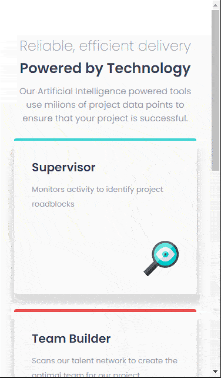

# Frontend Mentor Challenge | 3 Column Preview Card Component


#### Este é mais um desafio vindo do @Frontendmentor, é um exemplo de um menu contendo informações de tipos de carros.

## Índice

- [Capturas de telas](#capturas-de-telas)
- [Links](#links)
- [Construído com](#construído-com)
- [O que aprendi](#o-que-aprendi)
- [Desenvolvimento contínuo](#desenvolvimento-contínuo)
- [Recursos úteis](#recursos-úteis)
- [Luis Fernando Guimaraes](#autor)

### Capturas de telas

#### Tela Desktop


#### Tela Ipad


#### Tela Mobile



### Links

- Site URL: https://luis92guimaraes.github.io/3-columns-preview-card-component-main/

### Construído com

<div style="display: inline_block"><br>
  
       
</div>

### O que aprendi

Esse exercicio é proposto dentro do site @Frontend Mentor, foi um exercício que me permitiu ampliar meu conhecimento com o uso da propriedade Display Flex e Grid em conjunto. 

## Trechos de códigos

```
.container {
    display: flex;
    justify-content: center;
    align-items: center;
    min-height: 100vh;
}

.card {
    display: grid;
    grid-template-areas: "sedans suvs luxury";
    grid-template-columns: repeat(3, 320px);
    grid-template-rows: 550px;
    border-radius: 10px;
    overflow: hidden;
    box-shadow: 10px 10px 10px gainsboro;
}

.sedans {
    grid-area: sedans;
    background-color: var(--bg-sedans-color);
    padding: 54px;
} 

.suvs {
    grid-area: suvs;
    background-color: var(--bg-suvs-color);
    padding: 56px;
}

.luxury {
    grid-area: luxury;
    background-color: var(--bg-luxury-color);
    padding: 52px;
}

.title {
    color: var(--bg-color);
    font-family: 'Big Shoulders Display', sans-serif;
    text-transform: uppercase;
    font-size: 4rem;
    margin-top: 30px;
}
```

### Desenvolvimento contínuo

Pretendo continuar aprendendo cada vez mais sobre as ferramentas utilizadas nesse projeto, ainda tem muita coisa pra ser absorvida mas sigo confiante e feliz em estar conseguindo tornar meu conhecimento solido e poder realizar projetos como esse com mais clareza e confiança a cada dia de estudos.

### Recursos úteis

- [Mdn](https://developer.mozilla.org/en-US/) - O Mozilla Developer Network (MDN) desempenha um papel crucial ao fornecer recursos abrangentes e atualizados para desenvolvedores web em todo o mundo.
- [W3School](https://www.w3schools.com/css/default.asp) - Esse site sempre me ajuda a resolver qualquer problema relacionados a códigos de uma maneira fácil e muito rápida.
- [Dev em Dobro](https://www.youtube.com/@DevemDobro) - Este é um canal onde encontro muito material. Tem muito conteúdo relacionado ao desenvolvimento. Recomendo a todos que querem aprender sobre esse e outros conceitos relacionados.

## Autor

[Luis Fernando Guimarães](https://www.linkedin.com/in/luisfguimaraes/)
